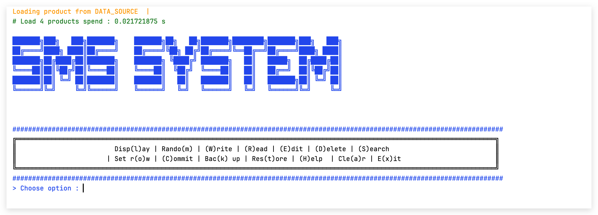

<!-- PROJECT LOGO -->
<br />
<div align="center">
  <a href="https://istad.co/">
    
  </a>

<h3 align="center">CSTAD</h3>

  <p align="center">
    <a href="https://github.com/YithSopheaktra8/stock-management-system">View Demo</a>
  </p>
</div>


<!-- TABLE OF CONTENTS -->
<details>
  <summary>Table of Contents</summary>
  <ol>
    <li>
      <a href="#about-the-project">About The Project</a>
      <ul>
        <li><a href="#built-with">Built With</a></li>
      </ul>
    </li>
    <li>
      <a href="#getting-started">Getting Started</a>
      <ul>
        <li><a href="#installation">Installation</a></li>
      </ul>
    </li>
    <li><a href="#usage">Usage</a></li>
  </ol>
</details>


<!-- ABOUT THE PROJECT -->
## About The Project




The stock management system is a simple program that is built with Java programming language. This program is built to manage the stock of a company. It allows the user to add, delete, update, and view the stock of the product or anything and using file I/O to store the data. 
This is a stock management system that is built with the following technologies:

* JAVA PROGRAMMING LANGUAGE
* JAVA FILE I/O
* JAVA REGULAR EXPRESSION
* JAVA COLLECTIONS
* JAVA EXCEPTION HANDLING
* JAVA VERSION 21


<!-- GETTING STARTED -->
## Getting Started


### Installation

_Below is an example of how you can install and setting up your app.

1. Clone the repo
   ```sh
   git clone https://github.com/YithSopheaktra8/stock-management-system.git
   ```
2. Open the project in your IDE
   
3. Run the project from main method

### Library to download 

1. Kryo library for derialization and serialization
   <br><a href="https://jar-download.com/artifacts/com.esotericsoftware/kryo/4.0.0/source-code">Kryo Library</a>
2. Lombok library for using annotation and other shorthand code
   <br><a href="https://projectlombok.org/download">Lombok Library</a>
3. text table formatter library for formatting the table
   <br><a href="https://sourceforge.net/projects/texttablefmt/">Text Table Formatter Library</a>

<p align="right">(<a href="#readme-top">back to top</a>)</p>
